# AIMLCZG546 - Software Engineering for Machine Learning Assignment I
## AI Resume Screening System

**Group No:** 179

### Group Details

| Sl. No | BITS ID     | Name            | Contribution of team member (Qualitative)                                                                                                                                                                                                                   | Percentage Contribution |
| :----- | :---------- | :-------------- | :---------------------------------------------------------------------------------------------------------------------------------------------------------------------------------------------------------------------------------------------------------- | :---------------------- |
| 1      | 2025ab05113 | PRASHANT        | Formulated the problem statement and requirements, defined measurable goals, prepared GR4ML content, implemented the ML pipeline, developed the Streamlit application, performed integration testing, and drafted the initial report.                       | 100%                    |
| 2      | 2025aa05032 | PRATHAP WAGLE   | Created the GR4ML view diagrams and mappings, defined the system architecture, refined the architectural patterns, created architectural diagrams, reviewed code and added comments, validated application outputs, and completed the final project report. | 100%                    |
| 3      | 2024ac05999 | PRASANNA R T    | Documentation alignment, final verification                                                                                                                                                                                                                 | 100%                    |
| 4      | 2024ac05914 | PRANAV MEHROTRA | Documentation alignment, report verification                                                                                                                                                                                                                | 100%                    |

---

### Assignment Compliance Mapping

| Assignment Requirement                                                         | Where Addressed                                |
| :----------------------------------------------------------------------------- | :--------------------------------------------- |
| Select domain and define ML problem statement                                  | Section 1                                      |
| Formulate requirement specifications and measurable goals using GR4ML concepts | Section 2                                      |
| Develop Business View, Analytics Design View and Data Preparation View         | Sections 2.3 to 2.5                            |
| Identify top three quality requirements with justification                     | Section 3                                      |
| Draw system architecture showing ML and non-ML components                      | Section 4 \& Submission PDF                    |
| Select and apply two architectural patterns                                    | Section 5 \& Submission PDF                    |
| Implement selected architectural patterns                                      | Section 6 and Group179.ipynb / Group179_app.py |
| Include screenshots and code                                                   | Sections 7 and 8                               |

---

## 1. Selected Domain and Problem Statement

**Selected domain:** Human Resources / Recruitment Technology.

**Problem statement:** Recruiters receive a high volume of resumes for each job opening. Manual screening is time-consuming, inconsistent, and difficult to scale. The proposed AI Resume Screening System predicts the most suitable job role for a resume, assigns a confidence score, ranks possible job categories, and provides a simple explanation to support recruiter decisions. 

The system is a decision-support application; it does not automatically reject candidates.

---

## 2. Requirement Specifications Using GR4ML Concepts

GR4ML is used to connect business goals, ML tasks, data preparation activities, measurable goals, and quality requirements. The solution models the ML application from business intent to analytics design and data preparation.

### 2.1 Functional Requirements

| ID   | Requirement                                      | Type        | Measurable Acceptance Criteria                                       |
| :--- | :----------------------------------------------- | :---------- | :------------------------------------------------------------------- |
| FR1  | User shall enter resume text.                    | Non-ML      | System prevents empty submissions.                                   |
| FR2  | System shall preprocess resume text.             | Non-ML      | Text is lowercased, noise is removed, whitespace is normalized.      |
| FR3  | System shall predict the most suitable job role. | ML          | Prediction returns one role from configured classes.                 |
| FR4  | System shall show confidence and role ranking.   | ML          | Output includes top role, confidence score and ranked probabilities. |
| FR5  | System shall provide explanation.                | ML + Non-ML | System displays matched keywords supporting the recommendation.      |
| FR6  | System shall store result for audit/demo.        | Non-ML      | Prediction is saved using a repository layer.                        |

### 2.2 Measurable Goals

| Goal                           | Measure                  | Target                                                  |
| :----------------------------- | :----------------------- | :------------------------------------------------------ |
| Reduce screening effort        | Prediction latency       | Less than 2 seconds for one resume in demo environment  |
| Improve recommendation quality | Accuracy / weighted F1   | At least 80% after training on sufficient labelled data |
| Support recruiter trust        | Explanation availability | Every prediction includes matched keyword explanation   |
| Maintain human oversight       | Auto-rejection behavior  | No automatic rejection; recommendation is advisory      |

---

## 3.1 GR4ML Business View
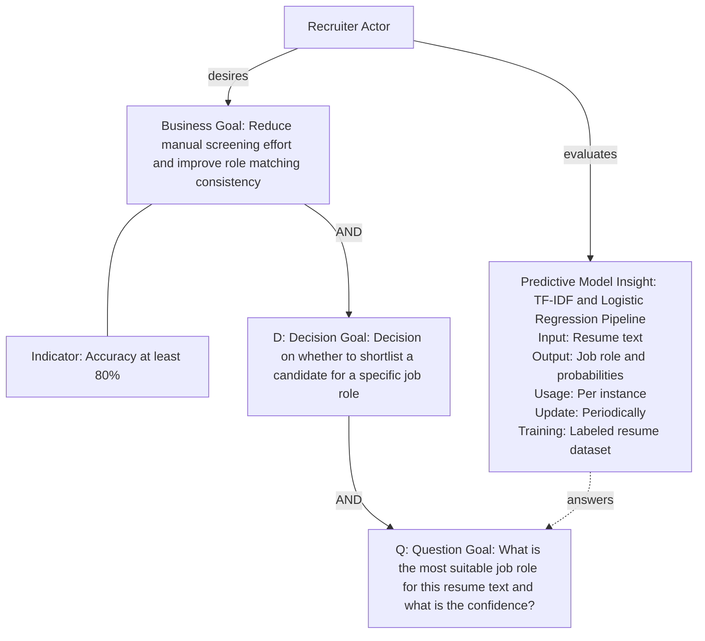

### 3.1.2 Predictive Model Component Details

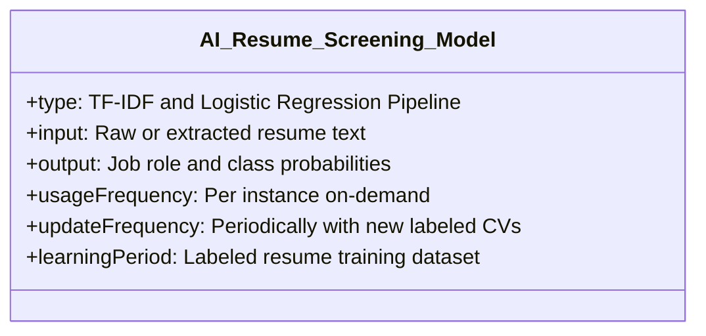

### 3.1.1 Engineering Lineage: Connecting Business Goals to ML Insights

To trace the engineering lineage of this system, we map our business goals down to the machine learning predictions:

1. **The Business Goal:**
   * *Objective:* "Reduce manual screening effort and improve role matching consistency."
   * *Implementation:* The Streamlit application handles raw files (PDFs, DOCXs, TXT) and processes them in milliseconds via `extract_resume_text()`. Preprocessing and model classification ensure that every resume is graded against identical TF-IDF feature distributions, establishing a standardized and objective rating process.

2. **The Decision Goal (D):**
   * *Objective:* "Decision on whether to shortlist a candidate for a specific job role."
   * *Implementation:* The `ResumeScreeningApplication` coordinates results, presenting predictions alongside a human-oversight warning: *"Recommendation supports recruiters, but final shortlisting remains a human decision."* This keeps the recruiter in control of the operational choice while backing their choices with clear metrics.

3. **The Question Goal (Q):**
   * *Objective:* "What is the most suitable job role for this resume text and what is the system's prediction confidence?"
   * *Implementation:* Answered programmatically by the `ResumeScoringService` and `ResumeClassifier.predict()`, which return the most suitable role label, the maximum probability score as confidence, and a full sorted role ranking for borderline cases.

4. **The Predictive Model (Insight):**
   * *Objective:* TF-IDF + Logistic Regression classification.
   * *Implementation:* Encapsulated in the `ResumeClassifier` pipeline. It cleans the text, extracts word frequency features, computes multiclass class probabilities, and feeds these insights directly into the application layers to answer the Question Goal.


## 3.2 GR4ML Analytics Design View

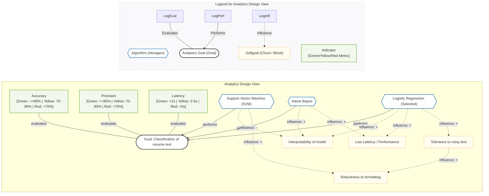

### 3.2.1 Design Rationale: Algorithm Selection and Quality Trade-offs

The Analytics Design View maps our candidate machine learning classifiers against the system’s quality attributes (softgoals):

1. **Logistic Regression (Selected):**
   * **Interpretability (+):** Feature weights directly reflect word importance, aiding explainability.
   * **Low Latency (+):** Extremely fast inference (<10ms) per resume.
   * **Tolerance to Noisy Text (+):** Regularization handles noisy token variations.
2. **Support Vector Machine (SVM):**
   * **Robustness (+):** Handles high-dimensional sparse TF-IDF text features well.
   * **Interpretability (-):** Decision boundaries are harder to explain to non-technical recruiters.
3. **Naïve Bayes:**
   * **Interpretability (+):** Probabilistic word frequencies are easy to explain.
   * **Low Latency (+):** Fast training and execution.

### 3.3 GR4ML Data Preparation View

The Data Preparation View models data sources, preparation activities, and resulting tables/matrices required for analytics tasks across the **Training Pipeline** and the **Inference Pipeline**.

#### 3.3.1 Training Data Preparation Pipeline
Transforms raw labeled resumes into TF-IDF feature matrices for model fitting:

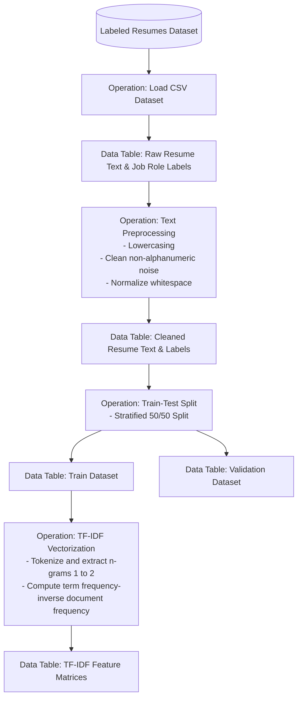

#### 3.3.2 Inference Data Preparation Pipeline
Real-time transformation of recruiter-submitted resume documents:

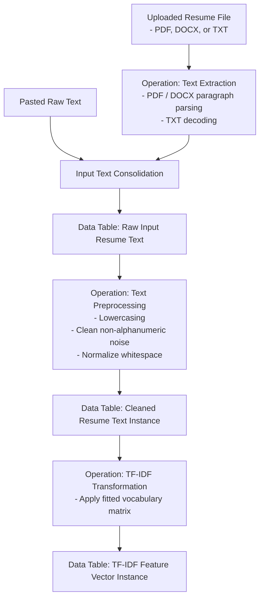

## 3.4 Linking the Three Views

By linking the GR4ML views, we establish an end-to-end lineage tracing business strategy down to data engineering assets:
1. Data Preparation outputs (`Cleaned Resume Text` and `TF-IDF Feature Matrices`) are required for the Analytics Goal (`Classification of resume text`).
2. Executing the Analytics Goal generates the predictive model (`Resume Classifier`).
3. The `Resume Classifier` insight answers the Question Goal (`What is the most suitable job role for this resume and what is the confidence?`).
4. Answering the Question Goal enables the Decision Goal (`Decision on whether to shortlist a candidate for a specific job role`).
5. Making consistent shortlisting decisions satisfies the Business Goal (`Reduce manual screening effort and improve role matching consistency`).

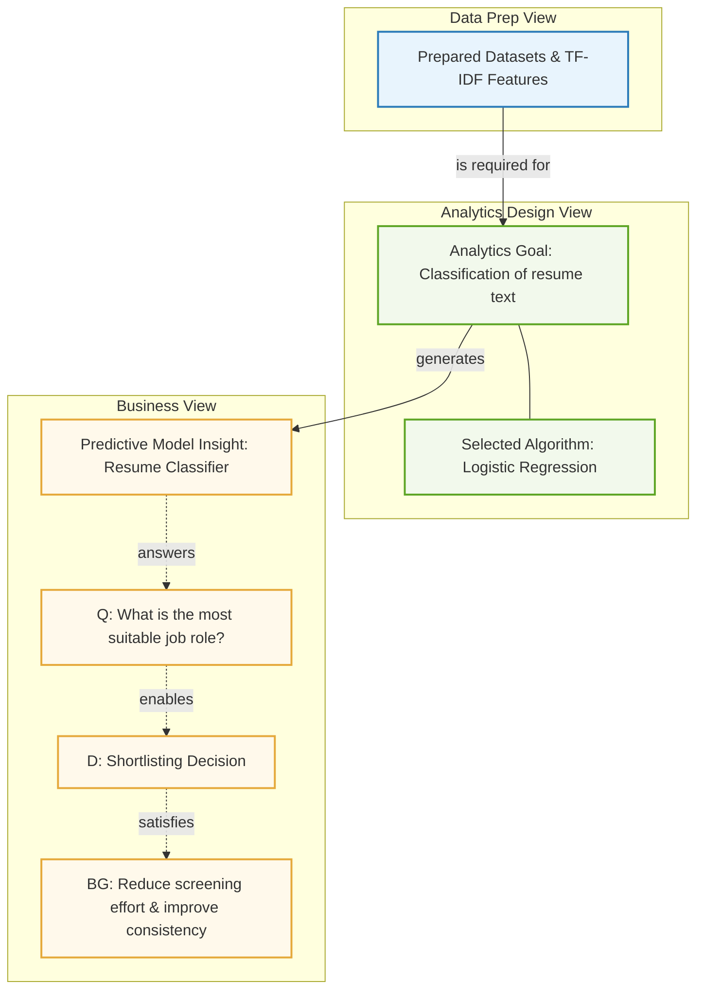

---

## 4. Top Three Quality Requirements

| Quality Requirement             | Why It Matters                                                                        | Metric                                            | Justification                                                                                 |
| :------------------------------ | :------------------------------------------------------------------------------------ | :------------------------------------------------ | :-------------------------------------------------------------------------------------------- |
| **Accuracy**                    | Incorrect role recommendation can waste recruiter time and harm candidate experience. | Accuracy, precision, recall, F1                   | The ML model is central to the system, so prediction quality directly affects business value. |
| **Explainability**              | Recruiters need to understand why a resume was recommended.                           | Explanation coverage = 100% predictions           | Recruitment decisions require transparency and human accountability.                          |
| **Scalability and Performance** | Recruiters may process many resumes in shortlisting campaigns.                        | Prediction latency < 2 seconds per resume in demo | A useful screening system must remain responsive when candidate volume increases.             |

---

## 5. System Architecture

The architecture clearly separates **Machine Learning (ML)** components (green) from **Non-Machine Learning (Non-ML)** components (blue).

- **Non-ML Components:** Presentation Streamlit UI, Document Text Extractor (`extract_resume_text`), Resume Submission DTO (`ResumeSubmission`), Application Orchestrator (`ResumeScreeningApplication`), Business Scoring Service (`ResumeScoringService`), Persistence Repository (`ResumeRepository`), and Audit CSV file (`resume_screening_audit.csv`).
- **ML Components:** Text Preprocessor (`clean_text`), TF-IDF Vectorizer (`TfidfVectorizer`), Logistic Regression Classifier (`LogisticRegression`), ML Pipeline Container (`ResumeClassifier`), and Model Evaluator (`build_model_summary`).

The detailed system architecture diagrams are available in the submission PDF.

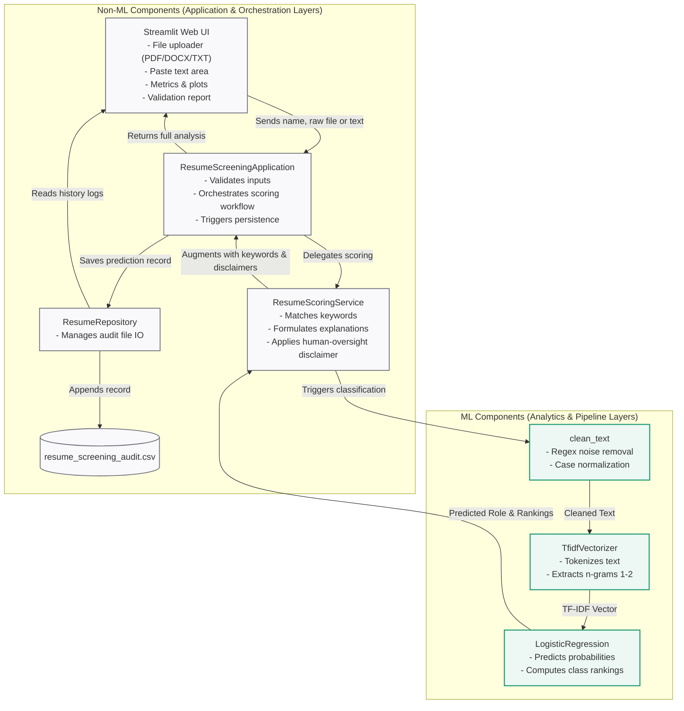

### 5.1 Component Classification Matrix

| Component Name               | Python Construct | Component Type | Summary Description                                                     |
| :--------------------------- | :--------------- | :------------- | :---------------------------------------------------------------------- |
| `clean_text()`               | Function         | **ML**         | Cleans noise, lowercases, and normalizes text for vectorization.        |
| `TfidfVectorizer`            | Scikit-Learn     | **ML**         | Converts cleaned text into numerical TF-IDF feature matrices.           |
| `LogisticRegression`         | Scikit-Learn     | **ML**         | Fits classification model and calculates role probability distribution. |
| `ResumeClassifier`           | Class Pipeline   | **ML**         | Wraps Scikit-Learn pipeline for training and inference workflows.       |
| `build_model_summary()`      | Function         | **ML**         | Splits data, trains model, and computes evaluation metrics.             |
| `extract_resume_text()`      | Function         | Non-ML         | Extracts text from uploaded TXT, PDF, and Word document files.          |
| `ResumeSubmission`           | Dataclass DTO    | Non-ML         | Holds candidate name, raw resume text, and submission source.           |
| `ResumeScoringService`       | Class            | Non-ML         | Matches domain keywords, builds explanations, and attaches disclaimers. |
| `ResumeScreeningApplication` | Class            | Non-ML         | Orchestrates user submission workflow and triggers persistence.         |
| `ResumeRepository`           | Class            | Non-ML         | Manages CSV read and write operations for audit history logging.        |
| `main()` \& Streamlit        | Functions        | Non-ML         | Renders user input form, dashboard metrics, and audit history.          |

---

## 6. Architectural Patterns

The system implements four distinct architectural patterns:

### 6.1 Pattern 1 - Layered Architecture Pattern (N-Tier Architecture)

Layered architecture separates responsibilities into distinct horizontal layers: **Presentation Layer**, **Ingestion Layer**, **Application Layer**, **Domain/Business Layer**, **ML Pipeline Layer**, and **Persistence Layer**.

#### High-Level Layer Stack
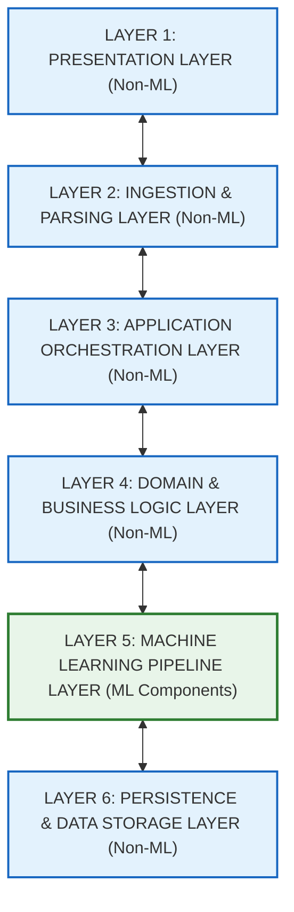

#### Detailed Component Flow
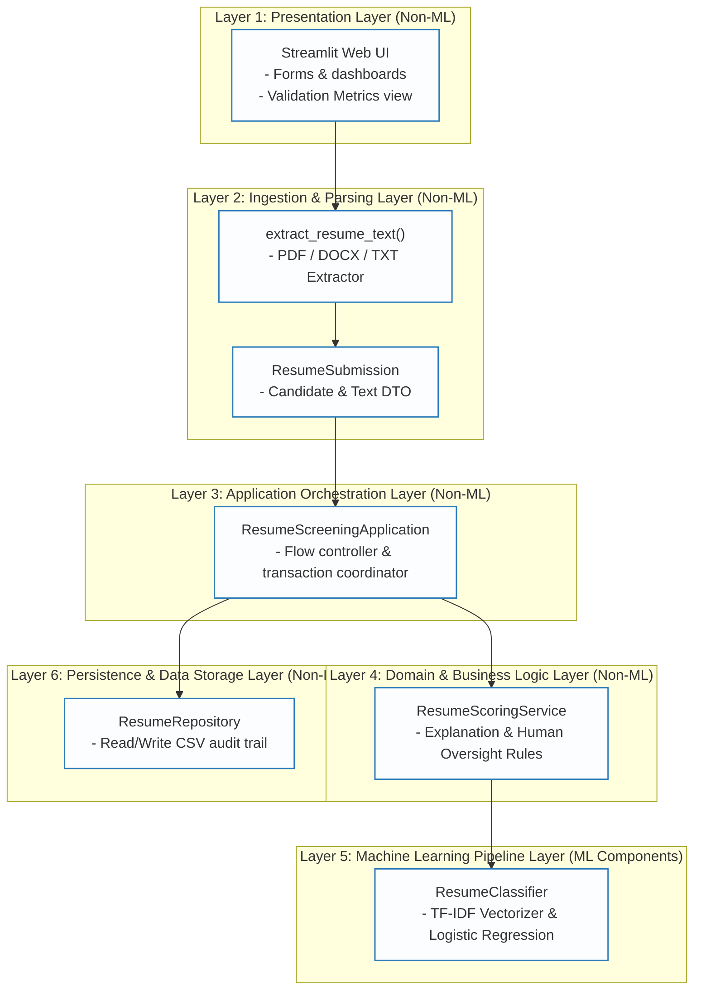

---

### 6.2 Pattern 2 - Pipe and Filter Architectural Pattern

The processing of candidate resumes is modeled as a sequence of independent data processing components (**Filters**) connected by communication channels (**Pipes**):

$$\text{Raw Document} \xrightarrow{\text{Pipe 1}} \text{Filter 1: Extractor} \xrightarrow{\text{Pipe 2}} \text{Filter 2: Preprocessor} \xrightarrow{\text{Pipe 3}} \text{Filter 3: Vectorizer} \xrightarrow{\text{Pipe 4}} \text{Filter 4: Classifier} \xrightarrow{\text{Pipe 5}} \text{Filter 5: Scoring} \xrightarrow{\text{Pipe 6}} \text{Filter 6: Repository}$$

```mermaid
graph LR
    P1[Pipe 1: Raw Resume File / Text] --> F1[Filter 1: Document Extractor]
    F1 --> P2[Pipe 2: Extracted Text]
    P2 --> F2[Filter 2: Text Preprocessor]
    F2 --> P3[Pipe 3: Normalized String]
    P3 --> F3[Filter 3: Feature Extractor]
    F3 --> P4[Pipe 4: TF-IDF Feature Matrix]
    P4 --> F4[Filter 4: Classifier Engine]
    F4 --> P5[Pipe 5: Predicted Role & Probs]
    P5 --> F5[Filter 5: Scoring & Explanation]
    F5 --> P6[Pipe 6: Result DTO]
    P6 --> F6[Filter 6: Audit Persistence]

    classDef pipe fill:#fff4d6,stroke:#c98b2f,stroke-width:2px;
    classDef filter fill:#eaf2ff,stroke:#4b74b8,stroke-width:2px;
    classDef mlfilter fill:#e8f5e9,stroke:#2e7d32,stroke-width:2.5px;

    class P1,P2,P3,P4,P5,P6 pipe;
    class F1,F5,F6 filter;
    class F2,F3,F4 mlfilter;
```

---

### 6.3 Pattern 3 - Monolithic Architectural Pattern

The application is deployed using the **Monolithic Architectural Pattern**. All layers—UI, Application Controller, Domain Logic, ML inference engine, and CSV persistence—run synchronously within a **Single Monolithic Python Host Process**.

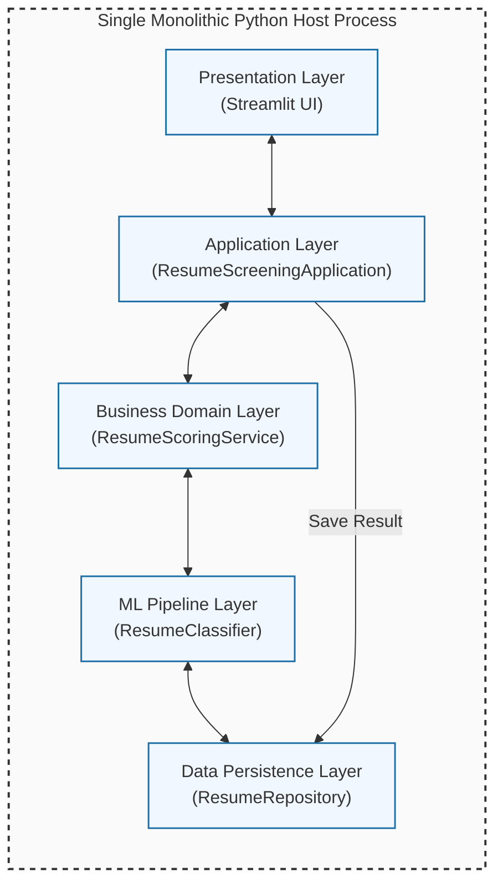

#### Rationale:
* **Deployment Simplicity:** Single script execution (`streamlit run Group179_app.py`) eliminates cluster management complexity during prototyping.
* **In-Memory Performance:** All inter-layer calls occur via memory heap function calls, eliminating network latency.

---

### 6.4 Pattern 4 - Real-Time & Transforming Serving Pattern

#### 6.4.1 Real-Time / Online Serving Pattern
Delivers predictions synchronously on-demand (<2s latency) when a recruiter submits a resume form, providing immediate feedback rather than relying on offline batch queues.

#### 6.4.2 Transforming Pattern
Features are extracted on-the-fly directly from raw client input payloads (`clean_text` + `TfidfVectorizer.transform`) without querying external feature stores.

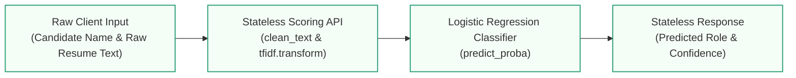

---

## 7. Implementation Summary

The accompanying `Group179_app.py` implements the architectural patterns using Python, pandas, scikit-learn, and Streamlit:

| Implementation Element       | Class / Function in `Group179_app.py`                       | Architectural Alignment                                                              |
| :--------------------------- | :---------------------------------------------------------- | :----------------------------------------------------------------------------------- |
| **Layer 1: Presentation**    | `main()`, `render_sidebar()`, `render_history()`            | Streamlit forms, metric widgets, audit log tables, and role distribution bar charts. |
| **Layer 2: Ingestion**       | `extract_resume_text()`, `ResumeSubmission`                 | Parses PDF, DOCX, and TXT files; encapsulates input data in DTOs.                    |
| **Layer 3: Application**     | `ResumeScreeningApplication`, `load_application()`          | Flow controller, singleton caching (`@st.cache_resource`), transaction orchestrator. |
| **Layer 4: Business Domain** | `ResumeScoringService`                                      | Keyword explanation matching, human oversight disclaimers, explainability rules.     |
| **Layer 5: ML Pipeline**     | `clean_text()`, `ResumeClassifier`, `build_model_summary()` | TF-IDF vectorizer (unigrams/bigrams) + Logistic Regression classification pipeline.  |
| **Layer 6: Persistence**     | `ResumeRepository`, `resume_screening_audit.csv`            | Audit CSV file I/O, persistence DAO, historical record tracking.                     |

---

## 8. Code Extracts

### 8.1 Application Orchestrator (`ResumeScreeningApplication`)
```python
class ResumeScreeningApplication:
    """Application flow coordinator orchestrating screening requests, scoring delegation, and persistence triggers."""

    def __init__(self, service: ResumeScoringService, repository: ResumeRepository):
        self.service = service
        self.repository = repository

    def submit_resume(self, submission: ResumeSubmission) -> Dict:
        """Coordinates resume analysis: delegates scoring to business domain -> saves record to repository."""
        result = self.service.score_resume(submission)
        self.repository.save_result(submission, result)
        return result

    def audit_history(self) -> pd.DataFrame:
        """Fetches recorded execution log DataFrame from the persistence repository."""
        return self.repository.list_results()
```

### 8.2 Machine Learning Pipeline (`ResumeClassifier`)
```python
class ResumeClassifier:
    """ML Pipeline Container encapsulating Scikit-Learn TF-IDF Vectorizer and Logistic Regression Model."""

    def __init__(self):
        """Initializes Scikit-Learn Pipeline combining unigram/bigram TF-IDF vectorization and Logistic Regression."""
        self.pipeline = Pipeline(
            [
                ("tfidf", TfidfVectorizer(ngram_range=(1, 2), min_df=1)),  # Filter 3: Feature Extraction
                ("clf", LogisticRegression(max_iter=1000, random_state=42)), # Filter 4: Multiclass Classification
            ]
        )

    def train(self, X: List[str], y: List[str]):
        """Fits the TF-IDF Vectorizer and Logistic Regression Classifier on cleaned training text."""
        self.pipeline.fit([clean_text(text) for text in X], y)
        return self

    def predict(self, resume_text: str) -> Dict:
        """Executes real-time inference on a resume text instance, returning top predicted role, confidence, and role rankings."""
        cleaned = clean_text(resume_text)
        probabilities = self.pipeline.predict_proba([cleaned])[0]
        predicted_role = str(self.pipeline.predict([cleaned])[0])
        
        ranking = sorted(
            zip(self.pipeline.classes_, probabilities),
            key=lambda item: item[1],
            reverse=True,
        )
        return {
            "predicted_role": predicted_role,
            "confidence": round(float(max(probabilities)), 3),
            "role_ranking": [(str(role), round(float(score), 3)) for role, score in ranking],
        }
```

### 8.3 Business Domain Scoring & Explanation (`ResumeScoringService`)
```python
class ResumeScoringService:
    """Domain service enforcing business rules, keyword explanation extraction, and recruiter oversight disclaimers."""

    KEYWORDS = {
        "Data Scientist": ["machine learning", "python", "statistics", "nlp", "tensorflow", "pytorch"],
        "Data Engineer": ["etl", "spark", "kafka", "warehouse", "airflow", "data lake"],
        "Backend Developer": ["java", "spring", "api", "microservices", "nodejs", "mongodb"],
        "QA Engineer": ["testing", "selenium", "playwright", "automation", "regression", "quality"],
        "Frontend Developer": ["react", "angular", "css", "frontend", "figma", "typescript"],
        "DevOps Engineer": ["docker", "kubernetes", "ci", "terraform", "aws", "grafana"],
    }

    def __init__(self, classifier: ResumeClassifier):
        self.classifier = classifier

    def score_resume(self, submission: ResumeSubmission) -> Dict:
        """Invokes ML inference, extracts matching keywords for explainability, and appends recruiter decision notes."""
        result = self.classifier.predict(submission.resume_text)
        predicted_role = result["predicted_role"]
        text = clean_text(submission.resume_text)
        
        matched_keywords = [
            keyword for keyword in self.KEYWORDS.get(predicted_role, []) if keyword in text
        ]
        result["explanation"] = "Matched keywords: " + (
            ", ".join(matched_keywords) if matched_keywords else "limited direct keyword match"
        )
        result["decision_note"] = (
            "Recommendation supports recruiters, but final shortlisting remains a human decision."
        )
        return result
```
